# :bread: WhatSub? - 서브웨이 샌드위치 조합 추천 서비스

## 1. :notebook_with_decorative_cover: PJT summary
- 팀명: A105
- 프로젝트명: WhatSub 
- 주제: 개인 추천 알고리즘을 적용한 SUBWAY 메뉴 추천 모바일웹
- 기간: 2022.08.22 - 2022.10.07

- 사용기술스택:

  - 협업, 버전관리 :  

  - 언어 :    

  - FE/BE framework :  

  - DB : 

  - 배포 :   

  - 디자인 :  

## 2. :ferris_wheel: 주요 기술

**Backend**

- Spring boot 2.7.3
- Spring Data JPA
- Spring Web
- Swagger 3.0.0
- QueryDSL
- Mysql DB 8.0.30-0

**Frontend**

- Visual Studio Code IDE
- Vue 2.6.14
- Vue-router 3.5.1
- Vuex 3.6.2
- Vuetify 2.6.7

**Deploy**

- AWS EC2
- ubuntu0.20.04.2
- Docker
- NGINX
- Certbot

## 3. :handshake: 협업 툴

- Git
- Notion
- JIRA
- MatterMost
- Webex
- Discord
- Visual Studio Code Live Share

## 4. :building_construction: 프로젝트 파일 구조 
- 파일 구조

## 5. :family: 팀원 역할 분배

## 6. :volcano: 프로젝트 산출물

- [기능정의서](https://evergreen-navy-d7f.notion.site/870e84099d3342359a0fd3ef06531e40)
- [와이어프레임](https://www.figma.com/file/WGOaRdUVENFfuCMPU3m9h3/%5B%ED%8A%B9%ED%99%94-PJT%5D-A105?node-id=54%3A1683)
- [컴포넌트다이어그램](https://www.figma.com/file/WGOaRdUVENFfuCMPU3m9h3/%5B%ED%8A%B9%ED%99%94-PJT%5D-A105?node-id=260%3A5454)
- [API](https://j7a105.p.ssafy.io/api/v1/swagger-ui/)
- [ERD](https://www.erdcloud.com/d/Gyp3shSQq5N24c8ny)
- 기술스택
- [UCC](./README.assets/A105_UCC.mp4)
- (서버)아키텍쳐
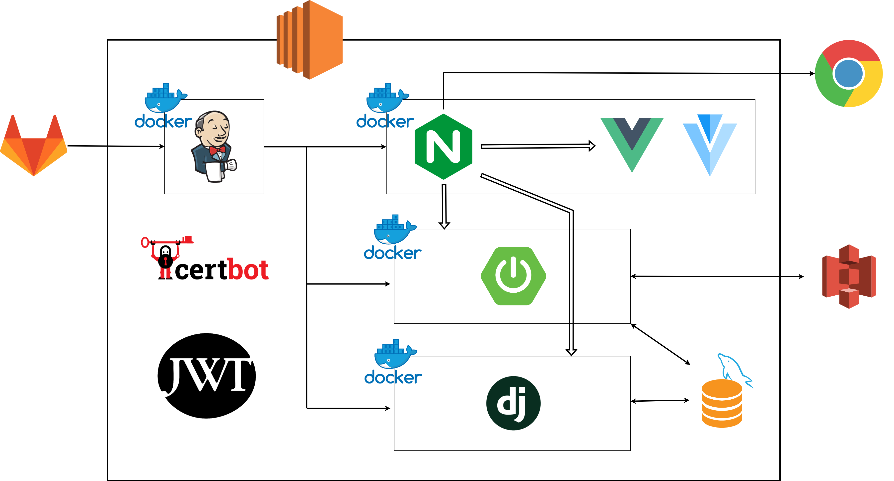

## 7. :label: 프로젝트 결과물

- [포팅매뉴얼](./exec/A105_포팅_매뉴얼.pdf)
- [중간발표자료](./README.assets/A105_중간발표자료.pdf)
- [최종발표자료](./README.assets/A105_최종발표자료.pdf)

## 8. :film_projector: Whatsub 서비스 화면

### 회원가입

- 카카오 로그인 / 회원가입
(닉네임 중복 검사를 해야 회원가입을 할 수 있습니다)

### 홈 화면

- 메뉴 추천

### 추천

* 홈 화면에서 기본 설문조사를 완료하면 썹BTI와 개인 맞춤 추천을 볼 수 있습니다.
* 추천 카드를 누르면 디테일로 넘어갑니다.

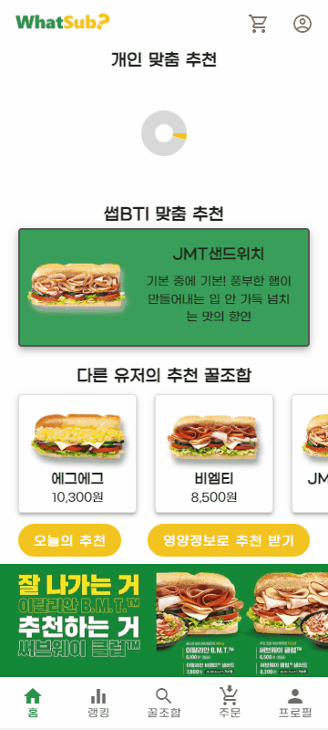

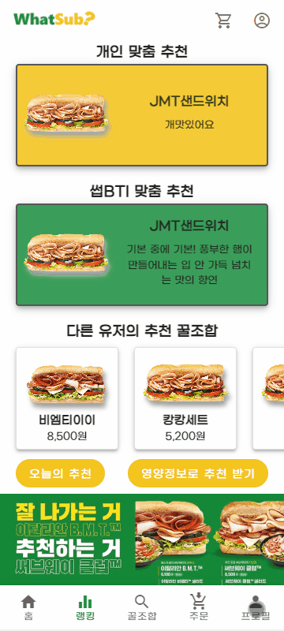

* 그날 그날의 상황에 따라 다른 추천을 받을 수 있습니다.

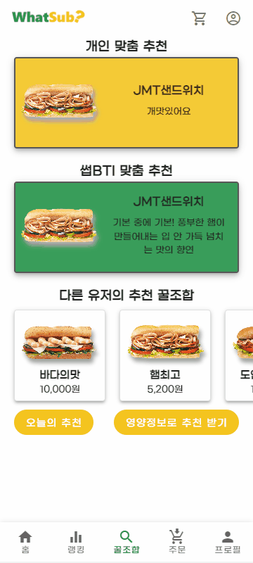

* 본인이 원하는 영양정보에 따라 추천을 받을 수 있습니다.

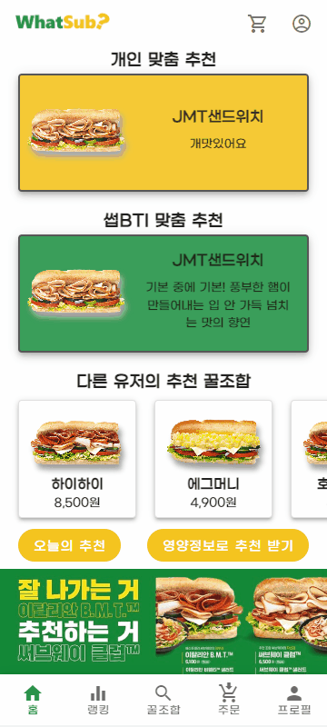

* 썹bti를 변경하면 그에 따라 추천메뉴가 변경됩니다.

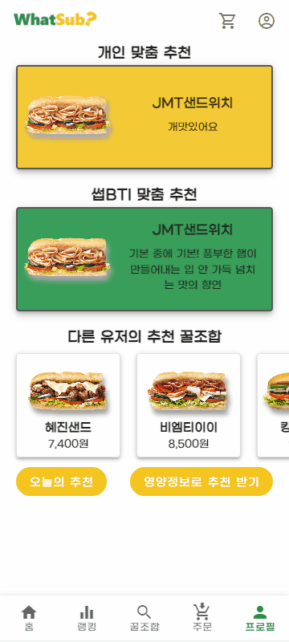

### 랭킹 화면

- 매달 각 샌드위치의 랭킹을 볼 수 있습니다.
- 랭킹을 통해 다른 유저의 프로필에 접근할 수 있습니다.

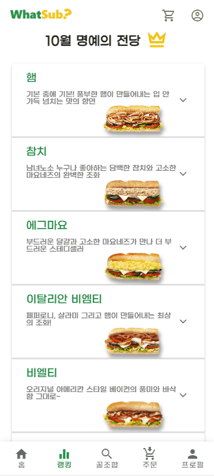

### 꿀조합 게시판

- 꿀조합게시판에서 다양한 꿀조합을 평점순, 최신순기준으로 볼 수 있습니다.
- 원하는 메뉴에 대한 꿀조합을 볼 수 있습니다.
- 해당 꿀조합을 누르면 꿀조합 디테일 페이지로 이동합니다.
- 꿀조합 디테일에서 바로 주문하러 갈 수 있습니다.

### 꿀조합디테일

* 꿀조합 디테일에서는 메뉴에 따른 조합정보, 영양정보, 분석정보를 볼 수 있습니다.
* 각 조합에 따른 댓글을 볼 수 있습니다.
* 조합을 찜 할 수 있습니다.

### 주문 화면

- 원하는 조합에서 주문을 하러 가면 그 조합에 따라 기본값이 지정되어 있습니다.
- 커스텀이 가능합니다.
- 주문에서는 선택한 메뉴에 따라 정보가 즉시 변경됩니다.

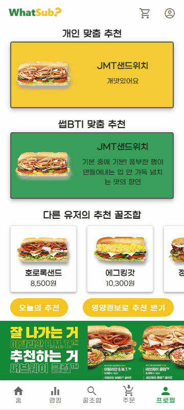

### 장바구니

* 장바구니에서는 본인이 담은 메뉴를 볼 수 있습니다.

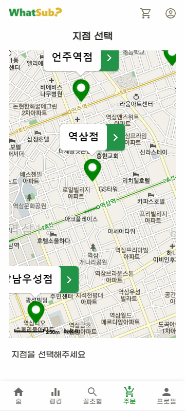

* 주문을 완료했다면 장바구니가 비워지고 다시 주문하러 갈 수 있습니다.

### 주문내역

* 주문을 완료하면 주문내용이 주문내역으로 이동됩니다.
* 주문한 매장을 다시 한번 확인할 수 있습니다.

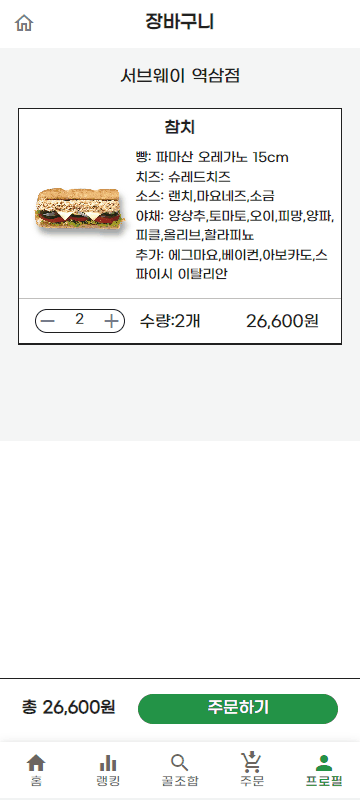

* 그 전에 주문내역으로 다시  한번 주문이 가능합니다.

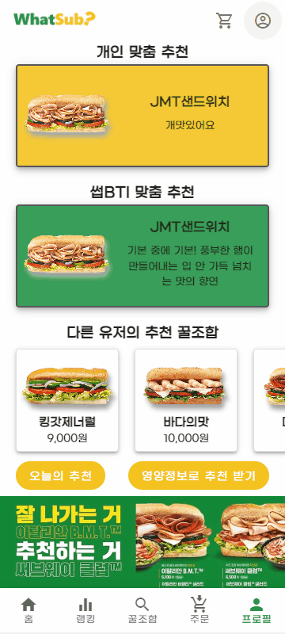

* 본인이 주문한 주문 내역에서 등록되지 않은 조합을 꿀조합에 등록할 수 있습니다.

### 프로필 화면

- 마이페이지에서는 본인이 찜한 목록과 등록한 꿀조합을 볼 수 있습니다.
- 매달 받을 수 있는 컬렉션 목록을 볼 수 있습니다.

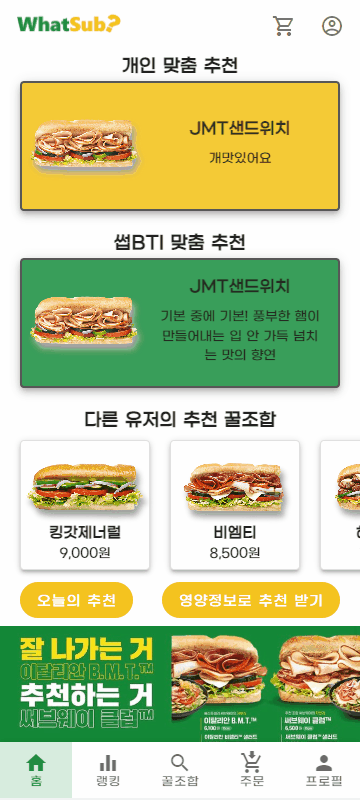

### 취향 설문

- 회원가입 후 불호 재료, 알레르기 설문을 통해 개인 맞춤화된 추천을 받을 수 있습니다.
- 입맛에 대한 설문조사로 썹BTI 검사를 진행하고 이를 꿀조합 추천에 활용합니다.

